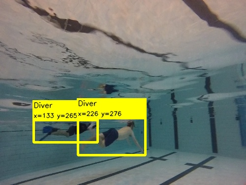
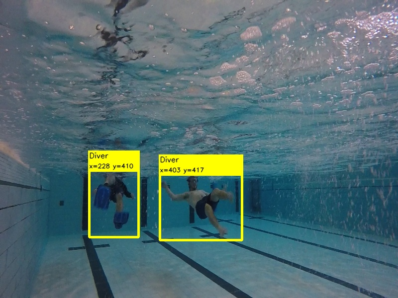

#Project for CNN-based diver following
>> Relevant papers: 
    >> https://ieeexplore.ieee.org/document/8543168
    >> https://onlinelibrary.wiley.com/doi/full/10.1002/rob.21837
  

## Testing the detector
For testing individual images, run the test_detector.py file
|      |      |

## Testing the diver-tracker
Run the test_diver_tracker.py 

## ROS version
>> The diver_following_cnn folder contain the ROS-package version, which contain code for diver detection and publishing the target bounding box
>> the target bounding box is used by yaw_pitch_controller for generating actual commands for following the diver
>> currently running on the Aqua MinneBot robot
>> more details: irvlab.cs.umn.edu  

