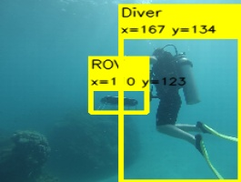
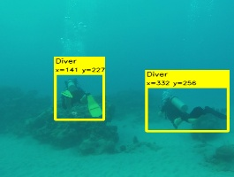

This is a container of modules for an autonomous diver-following project. 
  

## Testing the detector
For testing individual images, run the test_detector.py file
|||

## Testing the diver-tracker
Run the test_diver_tracker.py 

## ROS version
- The diver_following_cnn folder contain the ROS-package version, which contain code for diver detection and publishing the target bounding box
- The target bounding box is then used by a visual servoing controller in order to generate motion commands that drives the robot
- This version is currently running on the Aqua MinneBot robot (more details: irvlab.cs.umn.edu)
- Paper:  https://ieeexplore.ieee.org/document/8543168

